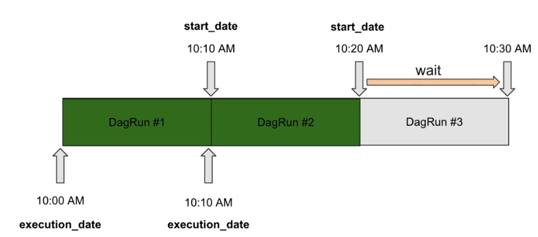
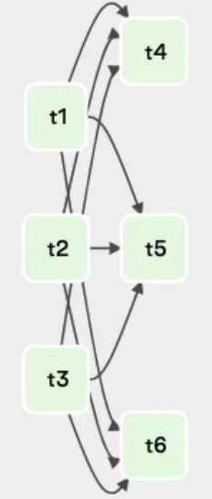
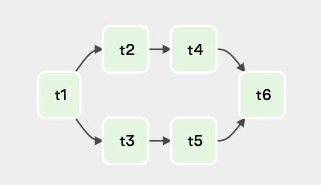
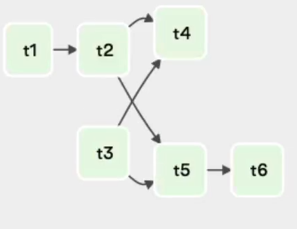

# Dag Files and Dag syntax 

Scheduler will only parse the file in dags/ folder if it contains the word "airflow" or "dag".
(attention when generating dags dynamically)

DAG_DISCOVERY_SAFE_MODE (core) to False, in case you want to parse all files in dags/ folder. (not recommended)

.airflowignore in case you want to have some files in the dag folder but not parsed as dags. (recommended)

### How to instantiate a Dag

`from airflow import DAG`

`from datetime import datetime, timedelta`

How to instantiate your DAG? Two Options:
1 - Context Manager (recommended)
```python
with DAG(...) as dag:
	DummyOperator()

```

2 - Creating variable dag (you have to do dag=dag in every operator, not recommended)

```python
dag = DAG("my_dag")
DummyOperator(dag=dag) # not using context manager
DummyOperator() # using context manager

```

### Dag Parameters

You can see all parameters [here](https://airflow.apache.org/docs/apache-airflow/stable/_api/airflow/models/dag/index.html) at "Parameters" section.

* dag_id
unique identifier of your dag among all your dags
If you have two dags with same dag_id, you dont receive any error and it will show ramdonly one or another after parsing.

* description
Best practice to describe your dag. 
Ex: description="DAG in charge of processing the customer data"

* start_date
It's not required in the dag object, but it is required for Operators and they will fail if not instantiated.
Instatiate in default arguments or dag object? Course says dag object.
```python
from datetime import datetime
Ex: start_date=datetime(2021,1,1)
```
- Each operator, each task can have a start_date!
- A good practice is have one start date for each dag.

* schedule_interval
Defines the frequency that the DAG is triggered.
Interval of time from the min(start_date) at which DAG is triggered.
Can be a cron, a timedelta object, expressions with "@".
Exs: '@daily','@weekly',timedelta(minutes=5),'* * * * * '

* dagrun_timeout
If dag execution duration is more than X time, it will kill tasks and skip tasks.
By default there is no timeout.
Useful for DAGs with little schedule interval, like 10 minutes, set a timeout of 12 minutes,for example.
EX: dagrun_timeout=timedelta(minutes=12)

* tags
Tags to each DAG, to filter dags in the UI. Useful for organizing DAGs, Teams, purpose, area, business unit...

* catchup
This says to trigger past dag runs automatically, if a daily dag paused for 5 days, when you unpause it, if catchup is True, it will trigger the DAG for all the days.
Setting this to false, remember you can run past tasks with CLI `airflow dags backfill`
- Best practice to always set catchup to False
- Always set to false with enviromnent variable (airflow.cfg or docker compose envs for example)

* max_active_runs
When you dont want many dag runs for the same dag at the same time, you can limit it with this parameter.


## Dag Scheduling

- Dag Trigger X Dag Run

Important parameters: start_date,schedule_interval.

"
The DAG X starts being scheduled from the `start_date` and will be triggered *after* every `schedule_interval`
"



So the execution_date is when the DAG run starts, but the DAG is TRIGGERED only AFTER the period of time. Initially, It have nothing to do with the DAG Run duration, only if `max_active_runs` is reached.

Example with minutes: start_date = 01/01/2022 10:00:00, schedule_interval=timedelta(minutes=10):
The DAG will run for the first time at 01/01/2022 10:10:00, triggered second time at 01/01/2022 10:20:00...

Example with day: start_date = 01/01/2022 10:00:00, schedule_interval=timedelta(days=1):
The DAG will run for the first time at 02/01/2022 10:00:00, triggered second time at 03/01/2022 10:00:00...


- Cron X Time Delta

Cron is stateless - always at that time.
"@" expressions are crons! @daily = '0 0 * * * '

Time Delta is stateful - get the last execution_date or if the first, the start_date. The DAG run starts at start_date + timedelta. With cron we dont have this!

Timedelta can be useful when you want "every 3 days" for example. When cron is convoluted to do with stateless and number of days like in cron.


### Task Idempotence and Determinism

- Deterministic DAG

If you execute your DAG with same input you get same output
Example: If you run your dag with date_execution X and other parameters, you have the same output. Tasks that get data from somewhere and upsert in a table for example. 

- Idempotence

If you execute DAG multiple times, you get the same effect.
Example: adding if not exists to create table statement,
```python

PostgresOperator(task_id='create_table', sql='CREATE TABLE IF NOT EXISTS...')
```

Make sure you can execute your tasks more than once, and with the same input, same output and the tasks have same effect. To rerun your tasks whenever you need!

### Backfill

You created your pipeline, but you want to run it in the past. 
With catchup = True, you can backfill all your DAG runs automatically when you unpause the DAG. 
But if your schedule interval is little and start_date is far away, you have too many dag runs at the same time.

To do a backfill with `catchup = False`, we can use the airflow CLI:
```bash
airflow dags backfill -s 2020-01-01 -e 2021-01-02
```
`s` = start_date
`e` = end_date

To control the number of simultaneously dag runs, use the parameter `max_active_runs`.

To use the UI to trigger past runs, use Search, filter your dag with name and then filter again "start date" and "end_date". Select them all, and in "Actions" set "Clear the state".

More at [documentation](https://airflow.apache.org/docs/apache-airflow/stable/cli-and-env-variables-ref.html?highlight=backfill#backfill) on backfilling.

## Variables

[Airflow Documentation](https://airflow.apache.org/docs/apache-airflow/stable/howto/variable.html) on variables.

If you have a S3 bucket or an API Endpoint that is used in many DAGS you should not put the same value in all your DAGs, so use variables!

Key: "name_of_variable"
Val: "value_of_variable"
Description: "Descrption of the variable"

Create variable
- UI: Admin => Variables => Create new
- API: 
- CLI: 

Tip: name your variables with the dag_id and then the variable = "my_dag_variable_name" to map where that variable is used. Then, you can search more easily with "Start with" in the Airflow UI.  

To use variables you need to:
```python
from airflow.models import Variable

my_variable = Variable.get("my_dag_variable_name")
```

When you instantiate a `Variable` in Airflow, it makes a connection to the matadata database (see limitations below).

### How to hide variables:

Just add one of the chosen words to your variable name:
'password','secret','apikey','api_key'

how to add more word SENSITIVE_VAR_CONN_NAMES at core in airflow.cfg

Then the variable is hidden in the UI and in the logs, even if you print it!

### Limitations of variables

- Connection to metadata DB

Variable.get() create a connection to the DB. If you instantiate this outside of a task, it will create a connection everytime the dag is parsed. That can be a problem with many DAGs and many variables, since the dag parse interval is 30 seconds as default. So instantiate the get() inside tasks!

Maybe you need to instantiate a variable outside task, if you generate dynamically tasks based on a variable, but always try to avoid this!

Other issue with connections, is, with you have many variables that are related to each other, for example, partner_name, partner_path and partner_secret, use a json in the value of the variable! Then you only use one connection to fetch many correlated information!

```python
my_dag_variable_name = {
	"name": "partner_a",
	"api_secret":"my_secret",
	"path": "/tmp/path"
}
partner_settings = Variable.get("my_dag_variable_name", deserialize_json=True)
name = partner_settings['name']
api_key= partner_settings['api_secret']
path = partner_settings['path']

```
If you want to pass the variable as a argument to an operator, using `Variable.get()` in "op_args" or "op_kwargs", it still will make a connection to the metadata DB every time the DAG is parsed.

To overcome this, use jinja templating!
With this you can get the key inside your dict/json!
```python
extract = PythonOperator(
task_id = 'extract',
python_callable = extract,
op_args = ["{{ var.json.my_dag_variable_name.name }}"]
```

### The Power of Environment Variables

To create a env variable in Docker, add this to your dockerfile (or docker compose env) :

```bash
ENV AIRFLOW_VAR_VARIABLE_NAME='{"name":"partner_a","api_secret":"my_secret","path": "/tmp/path"}'

```
That way, doesnt show on UI or CLI, and doesnt make a connection to the database!

There are 6 different ways of creating variables in Airflow 😱

    Airflow UI   👌
    Airflow CLI 👌
    REST API 👌
    Environment Variables ❤️
    Secret Backend ❤️
    Programatically 😖

Whether to choose one way or another depends on your use case and what you prefer.

Overall, by creating a variable  with an environment variable you

- Avoid making a connection to your DB
- Hide sensitive values (you variable can be fetched only within a DAG)

Notice that it is possible to create connections with environment variables. You just have to export the env variable:

AIRFLOW_CONN_NAME_OF_CONNECTION=your_connection

and get the same benefits as stated previously.

Ultimately, if you really want a secure way of storing your variables or connections, use a Secret Backend.

To learn more about this, click on this linkhttps://airflow.apache.org/docs/apache-airflow/stable/security/secrets/secrets-backend/index.html

Finally, here is the order in which Airflow checks if your variable/connection exists:

Secret Backends => Environment variable => DB


### Jinja Templating

One of the most powerful things to do with Airflow when authoring a DAG. Because with this you not only [many variables in default at run time](https://airflow.apache.org/docs/apache-airflow/stable/templates-ref.html), you cant make and access your own!

Using with a json environment variable, like before: 

```python
"{{ var.json.my_dag_variable_name.name }}"
```
Example:

Go to [Registry Astronomer PostgresOperator](https://registry.astronomer.io/providers/postgres/modules/postgresoperator)

See that `sql` is templated. If you go to the code of the PostgresOperator in ["View on GitHub"](https://github.com/apache/airflow/blob/main/airflow/providers/postgres/operators/postgres.py), you can see:
```python
template_fields = ('sql')
template_fields_renderes = {'sql': 'sql'}
template_ext = ('.sql',)
ui_coler = '#ededed'
```

```python
from aiflow.providers.postgres.operators.postgres import PostgresOperator

fetching_data = PostgresOperator(
    task_id="fetching_data",
    sql="SELECT partner__name FROM partners WHERE date='2022-01-01"
    )
# Above, with templating can be:
fetching_data = PostgresOperator(
    task_id="fetching_data",
    sql="SELECT partner__name FROM partners WHERE date={{ ds }}"
    )

```
But, you shouldn't put a raw query like this in your DAG!
Create a query_file.sql in your `dags/sql`

And you saw that you can use `.sql` because it is templated.
So, you can use a .sql file! 

Like this:
```sql
SELECT partner__name FROM partners WHERE date={{ ds }}
```
And then the PostgresOperator:
```python
fetching_data = PostgresOperator(
    task_id="fetching_data",
    sql="sql/query_file.sql"
    )
```
This will work and make a "different" query in runtime!


But, you can customize the Operator, to template some parameters!

Define a new custom operator based on PostgresOperator:
```python
class CustomPostgresOperator(PostgresOperator):
    """docstring for CustomPostgresOperator"""
    template_fields = ('sql', 'parameters')
        
```
And then your `fetching_data` becomes:

```python
fetching_data = CustomPostgresOperator(
    task_id="fetching_data",
    sql="sql/QUERY.sql",
    parameters={
        'next_ds': '{{ next_ds }}',
        'prev_ds': '{{ prev_ds }}',
        'partner_name': '{{ var.json.mydagvariable.partner }}'
    }
    )
```

Then go to the Airflow UI, click on the dag, graph view, click on the task, `rendered` and see the template!


## Data with XCOMs

Share data between two different tasks. 
To create a XCOM you need to access the task instance object.
What's task intance? Whenever you trigger a task in Airflow you create a task instance (DAG > DAG Run).

```python
def _extract(ti):
    partner_name = "netflix"
    ti.xcom_push(key="partner_name",value=partner_name)

extract = PythonOperator(
    task_id="extract",
    python_callable=_extract)
```

The value that's "pushed" from `xcom_push` is serialized in JSON.
To get "back" the "pushed" value:

```python
def _process(ti):
    partner_name = ti.xcom_pull(key="partner_name", task_ids="extract")
    print(partner_name)
    
process = PythonOperator(
    task_id="process",
    python_callable=_process)
```

You can work with XCOMs in a simpler way!
Just with the `return` in the python function! But then the key name will be `return_value` as default.

```python
def _extract(ti):
    partner_name = "netflix"
    return partner_name


def _process(ti):
    partner_name = ti.xcom_pull(task_ids="extract")
    print(partner_name)
    

extract = PythonOperator(
    task_id="extract",
    python_callable=_extract)

process = PythonOperator(
    task_id="process",
    python_callable=_process)
```

If you have multiple values in XCOM?

```python
def _extract(ti):
    partner_name = "netflix"
    partner_path = "/partners/netflix"
    return {"partner_name":partner_name,"partner_path":partner_path}


def _process(ti):
    partner_settings = ti.xcom_pull(task_ids="extract")
    print(partner_settings['partner_name'])
    print(partner_settings['partner_path'])
    

extract = PythonOperator(
    task_id="extract",
    python_callable=_extract)

process = PythonOperator(
    task_id="process",
    python_callable=_process)
```


### Limitation with XCOMs

XCOMs are limited in size:
- for SQL Lite, max XCOM size = 2GB per XCOM
- for PostgreSQL, max XCOM size = 1GB per XCOM
- for MySQL, max XCOM size = 64Kb per XCOM

Work with the data references! Not the data itself!
Ex: share the s3 object path, not the object itself

Remember that each xcom_push and xcom_pull it's a connection to the DB!

XCOMs backends?


## TaskFlow API

We saw above, that is a little verbose to deal with XCOMs, even with returns. There is something that can be a little simpler to write, with the TaskFLow API!

TaskFlow API uses Decorators and deals with XCOM arguments. [TaskFlow Tutorial](https://airflow.apache.org/docs/apache-airflow/stable/tutorial_taskflow_api.html)

### Decorators:
- Create a Operator automatically for you
- @task.python
- @task.virtualenv
- @task_group

Always import  `task` `from airflow.decorators`.

As a good practice, instance your decorator as `@task.python` or `@task.virtualenv` and not only `@task`, but you can.

Here's a full example with decorators on the functions:

```python
from airflow import DAG
from airflow.operators.python import PythonOperator
from airflow.decorators import task

from datetime import datetime, timedelta

@task.python
def extract():
    partner_name = "netflix"
    partner_path = "/partners/netflix"
    return {"partner_name":partner_name,"partner_path":partner_path}

@task.python
def process(ti):
    partner_settings = ti.xcom_pull(task_ids="extract")
    print(partner_settings['partner_name'])
    print(partner_settings['partner_path'])

with DAG("my_dag",
    description="DAG in charge of processing customer data",
    start_date=datetime(2021, 1, 1),
    schedule_interval="@daily",
    dagrun_timeout=timedelta(minutes=10),
    tags=["data_science","customers"],
    catchup=False,
    max_active_runs=1) as dag:
    

    extract() >> process()
```

And now a full example with dag decorators as well.

Remove the task_id from the definition, and put it on a function `def my_dag_name():`


```python
from airflow import DAG
from airflow.operators.python import PythonOperator
from airflow.decorators import task, dag

from datetime import datetime, timedelta

@task.python
def extract():
    partner_name = "netflix"
    partner_path = "/partners/netflix"
    return {"partner_name":partner_name,"partner_path":partner_path}

@task.python
def process():
    print('process')

@dag(description="DAG in charge of processing customer data",
    start_date=datetime(2021, 1, 1),
    schedule_interval="@daily",
    dagrun_timeout=timedelta(minutes=10),
    tags=["data_science","customers"],
    catchup=False,
    max_active_runs=1)

def mydag():
    extract() >> process()

my_dag
```


### XCOM Arguments:
- Share data between your tasks without XCOM push and pull
- Helps explicit your implicit dependecies between your tasks

Using the same example as before:

```python
from airflow import DAG
from airflow.operators.python import PythonOperator
from airflow.decorators import task, dag

from datetime import datetime, timedelta

@task.python
def extract():
    partner_name = "netflix"
    partner_path = "/partners/netflix"
    return partner_name

@task.python
def process(partner_name):
    print(partner_name)

@dag(description="DAG in charge of processing customer data",
    start_date=datetime(2021, 1, 1),
    schedule_interval="@daily",
    dagrun_timeout=timedelta(minutes=10),
    tags=["data_science","customers"],
    catchup=False,
    max_active_runs=1)

def mydag():
    process(extract())

my_dag
```

We can see that we only used the argument in the function `process` and then instantiate one "inside" the other in `mydag`. With this Airflow make the dependecies like `extract >> process` and at the same time passing arguments like push and pull from XCOMs

-  XCOMs in TaskFlow

Now we will see some arguments to the `task.python` decorator and "push" multiple XCOMs.

```python
from airflow import DAG
from airflow.operators.python import PythonOperator
from airflow.decorators import task, dag

from datetime import datetime, timedelta

# from typing import Dict  # Here to use with "-> Dict"

@task.python(task_id="extract_partners", multiple_outputs=True)
# def extract() -> Dict[str, str]: # Is the same as using "multiple_outputs"
def extract():
    partner_name = "netflix"
    partner_path = "/partners/netflix"
    return {"partner_name":partner_name,"partner_path":partner_path}

@task.python
def process(partner_name,partner_path):
    print(partner_name)
    print(partner_path)

@dag(description="DAG in charge of processing customer data",
    start_date=datetime(2021, 1, 1),
    schedule_interval="@daily",
    dagrun_timeout=timedelta(minutes=10),
    tags=["data_science","customers"],
    catchup=False,
    max_active_runs=1)
def mydag():

    partner_settings = extract()
    process(partner_settings['partner_settings'],partner_settings['partner_path'])

my_dag
```


If you dont want to push the xcom dict `return_value = {"partner_name":partner_name,"partner_path":partner_path}` just add the argument `do_xcom_push` to the task.python decorator:

```python
@task.python(task_id="extract_partners", do_xcom_push=False, multiple_outputs=True)
```


## Grouping Tasks

### Subdags (hard way)

The sub DAG file at `dags/subdag/subdag_factory.py`
```python
from airflow.models import DAG
from airflow.decorators import task
from airflow.operators.python import get_current_context

@task.python
def process_a():
    ti.get_current_context()['ti']
    partner_name = ti.xcom_pull(key='partner_name', task_ids='extract_partners',dag_id='my_dag')
    partner_path = ti.xcom_pull(key='partner_path', task_ids='extract_partners',dag_id='my_dag')
    print('Process A')
    print(partner_name)
    print(partner_path)

@task.python
def process_b():
    ti.get_current_context()['ti']
    partner_name = ti.xcom_pull(key='partner_name', task_ids='extract_partners',dag_id='my_dag')
    partner_path = ti.xcom_pull(key='partner_path', task_ids='extract_partners',dag_id='my_dag')
    print('Process B')
    print(partner_name)
    print(partner_path)

@task.python
def process_c():
    ti.get_current_context()['ti']
    partner_name = ti.xcom_pull(key='partner_name', task_ids='extract_partners',dag_id='my_dag')
    partner_path = ti.xcom_pull(key='partner_path', task_ids='extract_partners',dag_id='my_dag')
    print('Process C')
    print(partner_name)
    print(partner_path)


def subgdag_factory(parent_dag_id, subdag_dag_id, default_args, partner_settings):
    with DAG(f'{parent_dag_id}.{subdag_dag_id}',default_args=default_args) as dag:

        process_a(partner_settings['partner_name'],partner_settings['partner_path'])
        process_b(partner_settings['partner_name'],partner_settings['partner_path'])
        process_c(partner_settings['partner_name'],partner_settings['partner_path'])
    return dag

```

The main DAG that runs the Sub Dag `dags/my_dag.py`

```python
from airflow.models import DAG
from airflow.operators.python import PythonOperator
from airflow.decorators import task, dag
from airflow.operators.subdag import SubDagOperator

from datetime import datetime, timedelta
from typing import Dict
from subdag.subgdag_factory import subgdag_factory

@task.python(task_id="extract_partners",do_xcom_push=False, multiple_outputs=True)
def extract():
    partner_name = 'netflix'
    partner_path = '/partners/netflix'
    return {"partner_name": partner_name, "partner_path": partner_path}

default_args = {
    'start_date': start_date=datetime(2021, 1, 1)
}

@dag(description="DAG in charge of processing customer data",
    default_args=default_args,
    schedule_interval="@daily",
    dagrun_timeout=timedelta(minutes=10),
    tags=["data_science","customers"],
    catchup=False,
    max_active_runs=1)

def my_dag():
    partner_settings = extract()

    process_tasks = SubDagOperator(
        task_id='process_tasks',
        subdag=subgdag_factory('my_dag', 'process_tasks', default_args),
        poke_interval=15,
        mode='reschedule'
    )

    extract() >> process_tasks

dag = my_dag()

```

### Task Groups (easy way)

The main DAG that runs the Task Group `dags/my_dag.py`

```python
from airflow.models import DAG
from airflow.operators.python import PythonOperator
from airflow.decorators import task, dag
from groups.process_tasks import process_tasks

from datetime import datetime, timedelta
from typing import Dict

@task.python(task_id="extract_partners",do_xcom_push=False, multiple_outputs=True)
def extract():
    partner_name = 'netflix'
    partner_path = '/partners/netflix'
    return {"partner_name": partner_name, "partner_path": partner_path}

default_args = {
    'start_date': start_date=datetime(2021, 1, 1)
}

@dag(description="DAG in charge of processing customer data",
    default_args=default_args,
    schedule_interval="@daily",
    dagrun_timeout=timedelta(minutes=10),
    tags=["data_science","customers"],
    catchup=False,
    max_active_runs=1)

def my_dag():

    partner_settings = extract()

    process_tasks(partner_settings)


dag = my_dag()

```

The task group file to keep your dag file clean at `dags/groups/process_tasks.py`

```python
from airflow.decorators import task, task_group
# context manager
# from airflow.utils.task_group import TaskGroup


@task.python
def process_a(partner_name,partner_path):
    print('Process A')
    print(partner_name)
    print(partner_path)

@task.python
def process_b(partner_name,partner_path):
    print('Process B')
    print(partner_name)
    print(partner_path)

@task.python
def process_c(partner_name,partner_path):
    print('Process C')
    print(partner_name)
    print(partner_path)

# With decorator
@task_group(group_id='process_tasks')
def process_tasks(partner_settings):
    process_a(partner_settings['partner_name'],partner_settings['partner_path'])
    process_b(partner_settings['partner_name'],partner_settings['partner_path'])
    process_c(partner_settings['partner_name'],partner_settings['partner_path'])
    return process_tasks


# With context manager
# def process_tasks(partner_settings):
#     with TaskGroup(group_id='process_tasks') as process_tasks:
#         process_a(partner_settings['partner_name'],partner_settings['partner_path'])
#         process_b(partner_settings['partner_name'],partner_settings['partner_path'])
#         process_c(partner_settings['partner_name'],partner_settings['partner_path'])

#     return process_tasks

```

You can have a task group inside a task group.
Just instantiate a task group inside a task group definition!


## Dynamic Tasks

If you have a dict of values, and want to execute the same tasks or task_groups for each one!

- `add_suffix_on_collision` parameter when difining dynamic tasks/task_groups
- or you can use a f'{value}' for defining the task_id 


## Choices with Branching

- BranchPythonOperator
```python
from airflow.operators.python import PythonOperator, BranchPythonOperator

def choosing_based_on_day_func(execution_date):
    #HAve to return a task_id
    day = execution_date.day_of_week
    if day == 1:
        return task_id_1
    elif day == 3:
        return task_id_2
    elif day == 5:
        return task_id_3
    else:
        return 'stop' #or using a shortcircuit operator before this


choosing_based_on_day = BranchPythonOperator(
    task_id=choosing_based_on_day,
    python_callable=choosing_based_on_day_func)
```
- BranchSQLOperator
- BranchDatetimeOperator
- BranchDayofWeekOperator

Common problem using branching is a task after the branching. 
If you choose one path and has a task after, it will be skipped, since not ALL tasks reached the final task in success. For this, you can use trigger rules.

Add a `trigger_rule` to your downstream task:
```python
final_task = DummyOperator(task_id='final_task',
                           trigger_rule='none_failed_or_skipped')
```


## Trigger Rules

Behavior of the task based on the tasks before.
The default is `trigger_rule='all_success`
- all_sucess (triggers if all parents tasks are in 'success' state)  
- all_failed (triggers if all parents tasks are in 'failed' state) 
- all_done (triggers if all parents are in 'success','skipped','failed')
- one_failed (does not wait to all tasks to complete, trigger if any task completed is failed)
- one_sucess (does not wait to all tasks to complete, trigger if any task completed is sucess)
- none_failed (triggers if all parents tasks are not in state 'failed')
- none_skipped (triggers if all parents tasks are not in state 'skipped')
- none_failed_or_skipped (all the tasks completed, and none failed, can be just one sucess and others skipped)
- dummy - just trigger regardless of the state of parents states, and don't wait for them.


## Set dependencies in tasks

- `set_upstream` and `set_downstream`
- Using the `>>` or `<<` syntax
    - Use `[]` to group tasks


```python
t2.set_upstream(t1)
#or
t1.set_downstream(t2)

t2 << t1
#or
t1 >> t2

[t1,t2,t3] >> [t4,t5,t6]  # (Does not work)

# We could try: 
[t1,t2,t3] >> t4
[t1,t2,t3] >> t5
[t1,t2,t3] >> t6

# But you if you want to create cross dependencies, you can use cross_downstream
# example 1
from airflow.models.baseoperator import cross_downstream

cross_downstream([t1,t2,t3],[t4,t5,t6])

#if you have another task after [t4,t5,t6] you have to

cross_downstream([t1,t2,t3],[t4,t5,t6])
[t4,t5,t6] >> t7

# If you use chain, you have to have a simmetry!

#example 2
from airflow.models.baseoperator import chain

chain(t1,[t2,t3],[t4,t5],t6) #middle must have same number of steps

#mix the two!

#example 3
from airflow.models.baseoperator import chain

cross_downstream([t2,t3],[t4,t5])
chain(t1,t2,t5,t6)


```





## Control your tasks

* Parallelism (`parallelism`)
- Default is 32 = You can run 32 tasks in the same time.
- Environment: Your entire airflow instance

* Dag Concurrency (`dag_concurrency`)
- Default is 16 = You can run 32 tasks in the same time.
- Environment: Your DAG

* Max Active runs per dag (`max_active_runs_per_dag`)
- Default is 16 = You can run 32 Dag Runs in the same time.
- Environment: Your DAG

* Max Active Runs (`max_active_runs`)
- Number of DAG Runs that can exist in the same time.
- Environment: Your DAG

* Task Concurrency (`task_concurrency`)
- In all DAG Runs, the amount of runs that this task can run in the same time.
- Environment: Your Task

* Pool (`pool`)
- In which pool the task will run.
- Environment: Your Task

### Pools

Only for these specific tasks, I want 1 task at a time and these other 3 at a time.
You can define a pool with a worker slots. 
Default all of the tasks, run in the pool `default_pool`
To create a new pool:
- In the UI, go to Admin/Pools create a pool with 1 slot.
- In the task definitions: `pool='new_pool'`.

Tips:
- In any operator, you can define how many slots the task will take with `pool_slots=3`.
- If you instantiate pool inside the SubDagOperator instantiation, the pool will not be used in the tasks inside the subdag. You have to instantiate the pool in the tasks.
    -  

### Task and DAG Priorities

To control which tasks go first or last, you can use the paramenter `priority_weight` that all operators have. The value in the parameter means higher the number, the higher the priority.

Priorities are evaluated in the same pool, if they are in different pools, each pool see it's own priorities.

There is an argument `wait_pool` that defines how the `priority_weight` of the tasks are computed.

These priorities, it's how the airflow computes which tasks runs first! Sum of the priorities backwards.
All tasks have a `priority_weight = 1`.

Example, if you have a pipeline that starts with two tasks (A,B) in parallel, then one task after (C), then one task (D) after C: 
- Downstream (default) 
    - Final task (D) priority_weight = 1
    - middle task (C) priority_weight = 1 + 1 = 2
    - First tasks (A,B) priority_weight = 1+1+1 = 3
- Upstream - Opposite of downstream
    - A,B priority_weight = 1
    - C priority_weight = 2
    - D priority_weight = 3
- Absolute - Just execute as the definition of priority_weights

You can prioritize the DAG over another, setting the weights of one all 99 and the other all 1, for example.
    

### Depends On Past

Depends on past is evaluated as tasks. If True, and task X failed on previous DAG RUN, it will not be triggered, no status at all (no failed, no skipped...).

Depends on past triggers the task if the task has a success status or skipped status
Manually triggered is also evaluated.

In first DAG RUN, depends on past is not evaluated (obvious)
In backfill jobs, the started date is overridden.

### Wait for downstream

Wait for downstream means that the same task in previous DAG RUN has a success status AND all directly downstream (not the downstream tasks of the directly downstream tasks) too.
 
Imagine a pipeline with 3 tasks A >> B >> C.
With `wait_for_downstream = True` for task A, on the second DAG RUN, task A and B need to have sucess status.
If B has a failed status, A will not trigger. But if A,B has a success status and C is failed, A WILL trigger.

`wait_for_downstream = True` also sets `depend_on_past = True` automatically.

One use case can be, if the tasks use a resource, and you have many DAG Runs, is a good practice to use it, to not have many tasks messing with the same resource (like a database for example.)


### Sensors

Sensors waits for something to happen to continue the pipeline.
It takes a worker slot from the pool! Some times just to do nothing!


Datetime sensor: You can use if some tasks you have to wait until determined datetime to trigger.

```python
from airflow.sensors.date_time import DateTimeSensor

task_sensor_date_time = DateTimeSensor(
    task_id='task_sensor_date_time',
    target_time="{{ execution_date.add(hours=9) }}", # especific for DateTimeSensor
    poke_interval=60, # in seconds
    mode='poke', #default is 'poke'
    timeout=60 * 60,  # in seconds, 7 days by default
    soft_fail=True, # after timeout, puts status = skipped
    exponencial_backoff=True # increase the poke_interval exponencially in each poke

    )

```

With `mode='reschedule'` you use a worker slot only when needed (good for large `poke_intervals` of more than 10 min, for example)

If there's chance that the sensor is never True, you need to define `timeout`! use wisely.

The argument `soft_fail` refers to `timeout`, so `execution_timeout` (that all operators have) doesn't evaluate `soft_fail`.

Always define a timeout!

## Timeouts

Timeout in the DAG instance:
- `dagrun_timeout=timedelta(minutes=10)`.
- It doesnt get evaluated by manually trigged DAG RUNs.

Timeout at the operator level
- `execution_timeout=timedelta(minutes=10)`.
- `execution_timeout` doesn't have a value by default.

Always define both! It's a good practice!

## What to do after the tasks/DAGs sucess/failed?

You can leverage trigger_rules, tasks only triggers if other tasks failed.

Or you can use callbacks!

DAGs:
- Want to do something if the DAG succeded? `on_success_callback=success_function`
```python
def success_function(context):
    print(context) #context contains much information about the DAG

```
- Want to do something if DAG failed? `on_failure_callback=failure_function`
```python
def failure_function(context):
    print(context) # send email, notification...

```

Tasks

- Failure: `on_failure_callback=failure_function`
```python
from airflow.exceptions import AirflowTaskTimeout, AirflowSensorTimeout

def failure_function(context):
    if context['exception']:
        if (isintance(context['exception'], AirflowTaskTimeout)):
            print('Task Timeout Error')
        if (isintance(context['exception'], AirflowSensorTimeout)):
            print('Sensor Timeout Error')
```

- Success: `on_success_callback=success_function`
- Retry: `on_retry_callback=retry_function`
```python
from airflow.exceptions import AirflowTaskTimeout, AirflowSensorTimeout

def retry_function(context):
    tries = context['ti'].try_number()
    if tries > 2:
        print('Too much tries')
```

If you have a error inside the failure callback function, the callback wont retry.

Use the context like the previous examples to personalize the actions in the callback. 

Learn more about context:
https://composed.blog/airflow/execute-context
https://airflow.apache.org/docs/apache-airflow/stable/templates-ref.html

## Ways to retry tasks

We should define the retries on your task, because often we dont want to fail the task on first try `retries = 0`.

We can define retries at the Airflow instance level, with `DEFAULT_TASK_RETRY` configuration, All tasks receive this by default.

We can define retries in the DAG level with `retries` argument in the `default_args`, all tasks inside that DAG received this retry count.

We can define retries in the task level, that overrides all of the above.
- `retries=2` : Argument in the definition of the task.
- `retry_delay=timedelta(minutes=5)` : States the interval between retries.
- `retry_exponencial_backoff=True` : Add more time to the interval between retries.
- `max_retry_delay=timedelta(minutes=60)` : Often used with `retry_exponencial_backoff` and when `retries` have a large number.


## Notifications - SLA

We can use SLAs to know if a task is getting longer to complete than expected!
SLA is different than timeouts. Just notify, and not fail the tasks that are running.


In the task definition, `sla=timedelta(minutes=5)`.
It uses the DAG `execution_date` + `sla` (not the start date of the task) to define the timestamp of the task SLA.

For example if you want to set a SLA for the DAG, just define a SLA argument in the last task!

To notify or do somenthing, use the `sla_miss_callback=sla_function` IN THE DAG DEFINITION, NOT TASK!

To make the `sla_function` you can use this parameters:
- dag: dag object
- task_list: all tasks
- blocking_task_list: tasks dependencies, if task 2 miss sla because of task 1 
- slas: 
- blocking_tis: same blocking_task_list, but for ti

```python
from airflow.exceptions import AirflowTaskTimeout, AirflowSensorTimeout

def sla_function(dag, task_list, blocking_task_list, slas, blocking_tis):
    print(task_list) # list of tasks that failed to meet the SLA
    print(blocking_task_list) # The tasks that "caused" the missed SLA
    print(slas)
    print(blocking_tis)
```

Notes:
- If the DAG is triggered manually, SLAs dont apply.
- You have to have configures the SMTP, and email parameter, to get the emails.

## DAG versioning

When you add tasks to your DAG, the past DAGRuns will not execute the new task, will have no status at all.

If you remove a task, the logs and task runs will be missing in the UI and hard to find logs.

So a best practice add a suffix in the DAG id `with DAG('process_x_0_1,...)` for example.

Wait for DAG versioning feature!

## Dynamic DAGs

### One File Method

```python
from airflow import DAG
from airflow.decorators import task
from datetime import datetime

partners = {
    'snowflake': {
        'schedule': '@daily',
        'path': '/data/snowflake'
    },
    'netflix': {
        'schedule': '@weekly',
        'path': '/data/netflix'
    }, 
}

def generate_dag(dag_id, schedule_interval, details, default_args):

    with DAG(dag_id, schedule_interval=schedule_interval, default_args=default_args) as dag:
        @task.python
        def process(path):
            print(f'Processing: {path}')
            
        process(details['path'])

    return dag

for partner, details in partners.items():
    dag_id = f'dag_{partner}'
    default_args = {
        'start_date': datetime(2021, 1, 1)
    }
    globals()[dag_id] = generate_dag(dag_id, details['schedule'], details, default_args)
```

Drawbacks:
- DAGs are generated every time the Scheduler parses the DAG folder (If you have a lot of DAGs to generate, you may experience performance issues
- There is no way to see the code of the generated DAG on the UI
- If you change the number of generated DAGs, you will end up with DAGs visible on the UI that no longer exist 

So, yes, it's easy to implement, but hard to maintain. That's why, I usually don't recommend this method in production for large Airflow deployments.

That being said, let's see the second method, which I prefer a lot more! 🤩

### Multi-File Method

This time, instead of having a single Python file in charge of generating your DAGs, you are going to use a script that will create a file for each DAG that is generated. At the end you will get one Python File per generated DAG.

I won't provide the full code here,  but let me give you the different steps:

- Create a template file corresponding to your DAG structure with the different tasks. In it, for the inputs, you put some placeholders that the script will use to replace with the actual values.
- Create a python script in charge of generating the DAGs by creating a file and replacing the placeholders in your template file with the actual values.
- Put the script, somewhere else than in the folder DAGs.
- Trigger this script either manually or with your CI/CD pipeline.

The pros of this method are numerous!

- It is Scalable as DAGs are not generated each time the folder dags/ is parsed by the Scheduler
- Full visibility of the DAG code (one DAG -> one file)
- Full control over the way DAGs are generated (script, less prone to errors or "zombie" DAGs)

Obviously, it takes more work to set up but if you have a lot of DAGs to generate, that's truly the way to go!

## Dag Dependencies with External Task Sensor

A sensor that waits for another task in another DAG to complete.
It waits a specific task within a especific execution_date.

It brings a issue, if the DAG with the sensor does not have the same schedule interval?

Can be very complicated to sync the Task Sensor and the schedule intervals...

Use the `execution_delta` to define the delta between the execution_date of the dag, and the other dag that the sensor is looking for.

Use `exection_date_fn` if the calculation of the delta is more complicated, it expects a function.
This function takes as arguments the current execution_date and you can leverage the context dictionaries, (ti, dag object), as other arguments of this function.
It will return a list of execution_date to the sensor to check.

Define `failed_states` that is a list of statuses for the task which the sensor will read from. In other words, fail the sensor if the task that it is reading is in these statuses.

Define `allowed_states` that is a list of statuses for the task which the sensor will read from. In other words, the sensor will succeed if the task that it is reading is in these statuses.


```python
from airflow.sensors.external_task import ExternalTaskSensor

wait_for_external_task = DateTimeSensor(
    task_id='wait_for_external_task',
    external_dag_id='my_dag',
    external_task_id='task_id',
    execution_delta=timedelta(minutes=600),
    execution_date_fn= date_func(), # expects a function when the execution delta have to be more complicated
    failed_states=['failed','skipped'], # status to fail the external task sensor
    allowed_states=['success']

    )

```


## Dag Dependencies with Trigger DAG Run Operator

Maybe, you can do a task in the DAG that calls the other DAG, because using sensors to wait for one task in the other DAG can be complicated, to match the execution_dates mostly. 

- Arguments

In the `execution_date` argument you can define the execution_date that will be triggered by the operator.( `'{{ ds }}`)

Use the `wait_for_completion` if you want the triggered dag by the `TriggerDagRunOperator` is completed, before you go to the next task of the current DAG.

`poke interval` to see if the DAG triggered by the operator has finished. Has a 60 seconds by default.
When you see the `poke_interval` like in sensors you imagine it has a `mode` argument. But `TriggerDagRunOperator` is not a Sensor, it does not have this argument.

Use `reset_dag_run` when you want to reset the DAG Run triggered by the operator, at that execution_date. Because you can't have two DAG Runs with the same execution_date. So if you don't set this to `True` it will fail if you are backfilling for example. Always set this to True!

`failed_states` expects a list, and by default is not specified. Always define this when using `wait_for_completion`, because the operator will run forever if the DAG triggered by the operator failed. 


```python
from airflow.operators.trigger_dagrun TriggerDagRunOperator

trigger_next_dag = DateTimeSensor(
    task_id='trigger_next_dag',
    trigger_dag_id='my_dag',
    execution_date='{{ execution_date }}', # expects a string or datetime object
    wait_for_completion=True,  # wait for other DAG to complete to continue to next task in this DAG
    poke_interval=600,  # poke interval for wait_for_completion
    reset_dag_run=True, # Cleans the DAG Run with the same execution date if needed
    failed_states=['failed'] # Default is an empty list, DEfine THIS!
    )

```