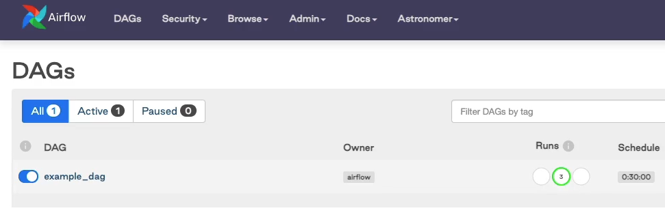
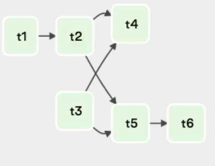

# Airflow Basics

## Installation

If you already have an instance of airflow skip these steps:

- Before begin, install airflow (docker installation is preferred at https://docs.docker.com/get-docker/)

- Astronomer CLI to go fast: https://www.astronomer.io/docs/cloud/stable/develop/cli-quickstart

Scheduler will only parse the file in dags/ folder if it contains the word "airflow" or "dag".
(attention when generating dags dynamically)

DAG_DISCOVERY_SAFE_MODE (core) to False, in case you want to parse all files in dags/ folder.

.airflowignore in case you want to have thins int he dag folder but not dags.


## Why Airflow?
Imagine you have to get data from an API, transform and load into a database, but as we know, each of these steps can fail. And with a lots of different pipelines like these, with only CRON, we can't handle dependencies, monitor, retry, and an UI! Airflow to resolve all these things! 

## What is Airflow?
Apache Airflow is an open source platform to programatically author, schedule and monitor workflows. Orchestrator of pipelines!
- Dynamic pipelines
- Scalable (Different Executors)
- Interactive (UI,API,CLI)
- Extensible (You can customize with python!)

Airflow is NOT a Streaming or Data Processing framework!

## Core Components

- Web Server (UI)
- Scheduler (Triggerer, can have multiple)
- MetaData Database (best is use SQL database Postgres,MySQL)
- Executor (How the tasks will be executed)
- Worker (Where the tasks will be executed)

## Architectures

There are numerous different architectures, there are two basic ones:

### Single Node
A single instance (machine). All core components in this machine.


### Multi Nodes
A multi instance deployment. Some components in differnt machines


## Core Concepts

### DAGs
DAG - Directed Acyclic Graph, is the definition of a pipeline.
Cannot contain loops, because then, the pipeline will never finish (Acyclic)
The edges are directed, there are dependencies and a direction.

### Operator
Denotes a task in your pipeline. Anything, like reading a file.
Task is an instance of an operator, and when a task is triggered, task instance is created.
- Action Operator: Execute a python, a bash command...
- Transfer Operator: Ex: Transfer data to MySQL to Presto
- Sensor Operator: Wait for something to happen to go to next task.

### Dependencies
Relationship between your tasks. First this task, then another...
You can define them with `set_upstream` or `set_downstream`.
But the better, cleaner way is using `>>` and `<<`

### Workflow
The concept of an DAG, that has instantiated operators.


## Task Lifecycle

DAGs Folder is parsed byt the scheduler every 5 minutes(default), to appear on the webserver.

Scheduler create a DagRun Object (Instance of a DAG) saves in the MetaStore.

DagRun with a Running status. 
Task Instance is created by Scheduler, and then the task instance gets a status `scheduled`. 
Scheduler sends the task to executor, and gets the status `queued`, then the executor is ready to send to the worker. 
After this, the task get the status `running`. 
If the task is succeded, the operator updates the task with the status `success`. 
The scheduler checks if the there are more tasks, if not and all tasks succeded, the DAG gets the status `success`. 
(Check trigger rules)

PS: You can monitor all the changes in the webserver.


## Extras and Providers
Extra components to install separately, like celery, users auth, connections to external services (postgres, kubernetes, aws, azure...)

## Interacting with Airflow

### UI
User interface, manage and monitor your pipelines.
Logs, History of DagRuns...
https://airflow.apache.org/docs/apache-airflow/stable/ui.html
- Sign In
- DAGs View
    - Pause/UnPause DAG
    - Name of the DAG
    - Owner
    - DAG Runs (Sucess, Running, Failed)
    - Schedule (Interval of Trigger)
    - Last Run (Last Execution Date)
    - Recent Tasks (Of the last DAG Run)
    - Actions (Trigger, Refresh, Delete (metadata))
    - Links (Views)



- Tree View 
    - History of DAG Runs (Circles)
    - History of Task Instances (Squares)
    - Many Statuses and colors (image below)
    - Good for checking status for all Tasks in one time!


- Graph View 
    - Main color indicate the operator type of that task
    - Border color indicate the status of that task
    - Hover the mouse above one task to get more information
    - Click on one task to see more options
    - You have to choose the DAG Run based on execution date
    - Runs: How many Runs to show in "Run"
    - Run: To choose the execution date to show the tasks
    - Layout: How to show the tasks: >, < , \/ or ^
    - Auto Refresh: Toogle this to see the pipeline changing every 2 seconds!
    - Good for checking dependencies between tasks


- Gannt View 
    - Graph that shows task durations (start and finish times)
    - Hover the mouse above one task to get more information
    - Click on one task to see more options
    - You have to choose the DAG Run based on execution date
    - Runs: How many Runs to show in "Run"
    - Run: To choose the execution date to show the tasks
    - Good for analyze task durations,overlaps, bootlenecks and parallel tasks


### Interact with Tasks
In some the views we saw above, we could click on the task. Clicking on it, we can interact with the task in several ways, the Task Instance Content Viewer.


- Task Instance Details
    - Task Instance Attributes - Metadata (id,run,duration,end_date...)
- Rendered
    - Output of the data injected at run time (templating)
- Log
    - Most important! All logs of the task instance!
- All Instances
    - All instances of this task in all of the DAG Runs
- Filter Upstream
    - Get only the upstream tasks of the current task
- Task Actions: Here you can execute actions with filters!
    -  Run: Run some tasks
        - Filters: Ignore All Deps, Ignore Task State, Ignore Task Deps
    - Clear: Important! Clear the state of desired task instances (to retry them!)
        - Filters: Past,Future,Upstream,Downstream,Recursive,Failed
    - Mark Failed/Sucess: To enforce failed/success on your tasks
        - Filters: Past,Future,Upstream,Downstream

### CLI
Command Line Interface

If you are using docker, you need to connect to one of Airflow's containers. Can be webserver, scheduler...
https://airflow.apache.org/docs/apache-airflow/stable/usage-cli.html

https://airflow.apache.org/docs/apache-airflow/stable/cli-and-env-variables-ref.html

`docker ps`
`docker exec -it [CONTAINER_ID] /bin/bash`

- Commands
    - `airflow db init`: Initialize metadata database, generate the files and folders.
    - `airflow db upgrade`: upgrade airflow instance (metadata database) 
    - `airflow db reset`: remove everything from metada database (don't use in production!)
    - `airflow webserver`: Start the webserver
    - `airflow scheduler`: Start the scheduler
    - `airflow celery worker`: Start the celery worker
    - `airflow dags pause/unpause [DAG id]`: Toogle of the UI
    - `airflow dags trigger [DAG id] [execution_date]`: Trigger DAG
    - `airflow dags list`: List all DAGs
    - `airflow dags tasks list [DAG id]`: List all tasks in some DAG
    - `airflow dags tasks test [DAG id] [Task id] [execution_date]`: Test some task in some DAG (good practice!)
    - `airflow dags backfill -s [start_date] -e [end_date] --reset_dagruns [DAG id]`: Rerun past DAG Runs from the past

Test your tasks, upgrade airflow, initialize airflow...


### API
REST API. Build something on top Airflow, or have a front-end to interact with airflow.
Most endpoints have CRUD operations!

https://airflow.apache.org/docs/apache-airflow/stable/stable-rest-api-ref.html


## DAGs and Tasks

### DAG Skeleton
- Imports
- `default_args`
- Functions to use as tasks
- DAG object instantiation
- Operators as tasks
- Tasks dependencies

```python
from airflow import DAG
from airflow.operators.dummy import DummyOperator
from airflow.operators.python import PythonOperator
from airflow.sensors.filesystem import FileSensor
from airflow.operators.bash import BashOperator

from datetime import datetime, timedelta

default_args = {
    'retry': 5,
    'retry_delay': timedelta(minutes=5),
}

def _failure(context):
    print("On failure Callback")
    print(context)

def _downloading_data(my_parameter,ds):
    print('downloading_data test')
    print('my_parameter: ' + str(my_parameter))
    print(ds)
    print('creating file...')
    with open('/tmp/my_file.txt', 'w') as f:
        f.write('my_data')
    print('finish creating file.')
    ti.xcom_push(key='my_key', value=42)

def _checking_data(ti):
    print('Getting xcom data...')
    my_xcom = ti.xcom_pull(key='my_key', task_ids['downloading_data'])
    print('myxcom = ' + str(myxcom))


with DAG(dag_id='simple_dag',
    start_date=datetime(2021,1,1),
    schedule_interval="@daily", # / "*/10 * * * *" / "@weekly" / timedelta(days=1)
    catchup=False,
    max_active_runs=3,

    ) as dag:

    task_1 = DummyOperator(
        task_id='simple_task'
    )

    downloading_data = PythonOperator(
        task_id='downloading_data',
        python_callable=_downloading_data,
        op_kwargs={'my_parameter': 42}
    )

    checking_data = FileSensor(
        task_id='checking_data',
        python_callable=_checking_data,
    )


    waiting_for_data = FileSensor(
        task_id='waiting_data',
        fs_conn_id='fs_default', # Create a connection to file system in the UI
        filepath='my_file.txt',
        poke_interval=15
    )

    processing_data = BashOperator(
        task_id='processing_data',
        bash_command='exit 1',
        on_failure_callback=_failure
    )


    task_1 >> downloading_data >> waiting_for_data >> processing_data
```

### DAG Scheduling
It's of foremost importance to understand when Airflow will trigger your DAGs, and how to set some important parameters to do it periodically.


- start_date = setted on DAG or Task definition (mandatory)
- schedule_interval = Setted on DAG definition 
- execution_date = Beginning of the scheduled period of the DAG Run
- first trigger timestamp = start_date + schedule_interval
- end_date = When the DAG will stop triggering

Example 1: Interval of 10 minutes

Imagining a database with timestamped records. The schedule interval is 10 minutes. and start_date = 10 AM on day 01/01/2021
The DAG will start effectively running on start_date + schedule interval, to compute the data between start_date and start_date + schedule interval. So the DAG will start runnning at 01/01/2021 at 10:10 AM, to compute data from 10:00 AM to 10:10 AM.
In the first run, start_date = 01/01/2021 10:10 AM, execution_date = 01/01/2021 10:00 AM.
In the second run, start_date = 01/01/2021 10:20 AM, execution_date = 01/01/2021 10:10 AM.

Example 2: Interval of 1 day

Imagining a database with timestamped records. The schedule interval is 1 day. and start_date = 01/01/2021 01:00 AM
The DAG will start effectively running on start_date + schedule interval, to compute the data between start_date and start_date + schedule interval. So the DAG will start runnning at 02/01/2021 at 01:00 AM, to compute data from 01/01/2021 at 01:00 AM to 02/01/2021 at 01:00 AM.
In the first run, start_date = 02/01/2021 01:00 AM, execution_date = 01/01/2021 01:00 AM.
In the second run, start_date = 03/01/2021 01:00 AM, execution_date = 02/01/2021 01:00 AM.

- Start Date Good Practices
    -Setting the start date in the past, AIrflow will trigger all DAG Runs, between start_date and now
    - Don't set start_date dynamically
    - Store dates in UTC

- Schedule Interval Good Practices
    - CRON (<crontab.guru>) or datetime intervals ([python timedelta](https://docs.python.org/3/library/datetime.html#timedelta-objects))
    - TimeDelta is relative, maybe better
    - `schedule_interval = None` when you want to only trigger manually/API/CLI

### Backfilling
When you want to rerun some DAG Runs, in specific dates (start_date and end_date)
    - `catchup = True`: when you toogle unpause DAG, it will trigger all DAG Runs between start_date and now
    - `catchup = False`: When toogle unpause DAG, only last DAG Run is triggered.
    - `max_active_runs = [Number]`: Number of max active DAG Runs.
    - `airflow dags backfill -s [start_date] -e [end_date] --reset_dagruns [DAG id]`

- Backfilling Good Practices
    - cactchup = False
    - Backfill with CLI

### Operators

#### Operators good Practices

    - Always separate your tasks in many operators, not one task that does it all.
    - unique task_id for every task
    - Idempotency: Every time you run task, you get the same results
    - To not repeat the same parameters for every task/operator, use `default_args`
    - If `default_args` is defined, you can define the different arguments in each task definition.
    - Visit [Base Operator Class](https://airflow.apache.org/docs/apache-airflow/stable/_api/airflow/models/baseoperator/index.html) to see all arguments.

#### Python Operator

    - `python_callable`: Function to be called when task initiates.
    - Access context of DAG. Since all operators inherit the Base operator, all context is in all operators!

    ```python
    def _downloading_data(**kwargs):
        print(kwargs)
        print(kwargs['ds'])
        pass
    ```
    OR
    ```python
    def _downloading_data(ds):
        print(ds)
        pass
    ```
    - `op_kwargs`: Use this to pass parameters to your functions.

#### Sensor Operator
Basic Operators that waits for something to happen, to continue the pipeline.
Example of sensor that waits of a file to exist.
By default the sensor verify every 30 seconds. Change that with `poke_interval` (in seconds)

```python
waiting_for_data = FileSensor(
    task_id='waiting_data',
    fs_conn_id='fs_default',
    filepath='my_file.txt',
    poke_interval=15
)
```
You have to create a connection in the UI (Admin > Connections > Add Connection)
PS: The Extra is encrypted, but you can see at the UI, but password not.


#### Bash Operator
Runs a bash command! Simple as that!

```python
    processing_data = BashOperator(
        task_id='processing_data',
        bash_command='exit 0'
    )
```

### Dependencies in tasks

```python
t2.set_upstream(t1)
#or
t1.set_downstream(t2)

t2 << t1
#or
t1 >> t2

[t1,t2,t3] >> [t4,t5,t6]  # (Does not work)

# We could try: 
[t1,t2,t3] >> t4
[t1,t2,t3] >> t5
[t1,t2,t3] >> t6

# But you can use cross_downstream
# example 1
from airflow.models.baseoperator import cross_downstream

cross_downstream([t1,t2,t3],[t4,t5,t6])

#if you have another task after [t4,t5,t6] you have to

cross_downstream([t1,t2,t3],[t4,t5,t6])
[t4,t5,t6] >> t7

# chain

#example 2
from airflow.models.baseoperator import chain

chain(t1,[t2,t3],[t4,t5],t6) #middle must have same number of steps

#mix the two!

#example 3
from airflow.models.baseoperator import chain

cross_downstream([t2,t3],[t4,t5])
chain(t1,t2,t5,t6)


```




### Exchanging Data
You can exchange data between tasks, with XCOMs. (Cross communication)
When you define a `return` in your task, it automatically create a XCOM.
You can see this in the webserver (Admin > XCOMs)


You can "pull" the data from another task with `ti.xcom_pull(key='return_value', task_ids=[[task_id]])`

Another way to create a "push" is with `ti.xcom_push(key=[key_to_define], task_ids=[[task_id]])`

DO not use XCOMs to process data!

The XCOM are stored in the airflow metadata database.
SQLite: 2GBs each
Postgres: 1GB each
MySQL: 64KB each


### Failure in Tasks and DAGs
Your tasks can fail! If you define the retries, the tasks will try again and again according to `retries` number and `retry_delay`.

To retry manually some task in many DAG Runs, got to Browse > Task Instances > Filters. Filter your task with state,task_id,dag_id... Then fix your issue in the code, select all the task instances and clear.

Try to retry only the task, not the whole DAG.

You can add `email: example@example.com`, `email_on_failure = True`,`email_on_retry = True`. If you configured the SMTP Server.

If you want to personalize what the airflow do on failure, use `on_failure_callback`.


### Executors

[Executors Documentation](https://airflow.apache.org/docs/apache-airflow/stable/executor/index.html)

Begind every executor, there is the queue, that defines the order. The queue is where the tasks will pulled and pushed by the workers, defining wchich executor to use.
By default is the executor is the SequentialExecutor
To check the executor, go to `airflow.cfg` at `executor = `
To check the metadata database, go to `airflow.cfg` at `sql_alchemy_conn = `

- SequentialExecutor: Only one task at a time (SQLite, only one write at a time)
- LocalExecutor: Execute many tasks at a time, single node (subprocess).
- CeleryExecutor: Use celery cluster to orchestrate tasks, multi node. (more used)
    - RabbitMQ or Redis to the queue.
    - `airflow celery worker` on each different worker machine (to escale)
    - Careful of the dependencies:
        - each worker have to have Airflow installed
        - Install task dependencies in each worker.  
- KubernetesExecutor: Use kubernetes to run a pod for each task
- CeleryKubernetesExecutor: Use celery ans kubernetes to orchestrate tasks

- To execute multiple tasks at same time:
    - `parallelism = [Number]`: Number of tasks at same time in all Airflow Instance, defined at `airflow.cfg` (32 default)
    - `dag_concurrency`: Number of DAG Runs to run at same time in all Airflow Instance, defined at `airflow.cfg` (16 default)
    - `max_active_runs_per_dag`: Number of DAG Runs to run at same time within the same DAG defined at `airflow.cfg` (16 default)
    - `max_active_runs_per_dag`: Number of DAG Runs to run at same time within the same DAG defined at DAG object.
    - `concurrency`: Number of Tasks to run at same time within the same DAG defined at DAG object.